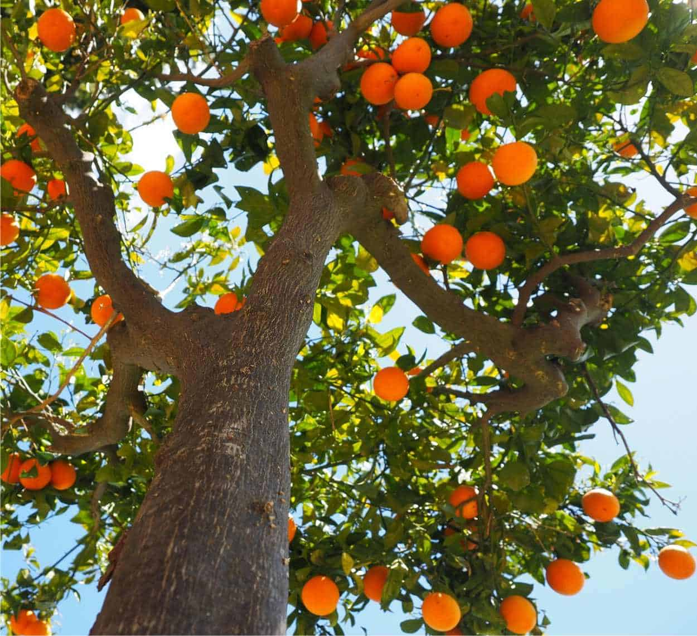

```{r setup, include = F}
knitr::opts_chunk$set(echo = F,
                      message = F,
                      warning = F,
                      error = F,
                      comment = "",
                      fig.align = "centre",
                      out.width = "50%")

library(emoji)
library(knitr)
library(stargazer)
load("Environment.RData")

hook_output <- knitr::knit_hooks$get("output")
knitr::knit_hooks$set(output = function(x, options) { 
  if (!is.null(n <- options$out.lines)) {
    x <- xfun::split_lines(x) 
    if (length(x) > n) {
      # truncate the output
      x <- c(head(x, n), "....\n")
}
x <- paste(x, collapse = "\n") 
}
hook_output(x, options) 
})
```

```{css, echo = F}

.gdbar img {
  width: 160px !important;
  height: 122px !important;
  margin: 8px 8px;
}

.gdbar {
  height: 140px !important;
}

aside.gdbar {
background: white
}

.author {
  color: #3B3B3B;
  font-size: 20px;
}

slides > slide.title-slide hgroup h1 {
  font-weight: normal;
  font-size: 40pt;
  color: #513612;
  position: fixed;
  letter-spacing: 10;
  top: 55%;
  left: 40%;
  transform: translate(-50%, -50%);
}

.title-slide {
    background:linear-gradient(180deg, #ffe0b5 40%, white 25%)
}

slides > slide.dark {
  background-color: #ec9f2e!important;
}

slides > slide.dark hgroup h2 {
  color: #513612;
  font-weight: normal;
  font-size: 40pt;
}

h2 {
    color: orange;
}

```

```{css, echo = F}
pre {
  max-height: 700px;
  overflow-y: auto, 
}

pre[class] { 
  max-height: 500px;
}
.scroll-100 {
  max-height: 500px;
  overflow-y: auto;
  background-color: inherit;
} 
```


<style>
.myClass {font-size: 10px;} </style>

# Alberi

## Quali sono gli alberi che producono le arancette? {.build}

### Sei alberi in totale 

<font size= "4">Abbiamo tanti alberelli diversi: <span style = "color:#a46b14"> Augusto, Alberto, Antonio, Alfonso, Alfredo e Ascanio.</span> 
\
Tutti con questo aspetto:
\
\
</font>

## E le arance? {.build}

<div style = "float : left; width: 50%; text-align: center;" >
<span style = "color:#a46b14">Arance piccole</span>
\
```{r, fig.cap = "", fig.align = "center",out.width= "50%", echo = F}
knitr::include_graphics(path = "img/Kumquat.jpg.webp")
```
</div>
<div style = "float : right; width: 50%; text-align: center;" >
<span style = "color:#a46b14">Arance grandi</span>
\
\
```{r, fig.cap = "", fig.align = "center",out.width= "50%", echo = F}
knitr::include_graphics(path = "img/Arance.jpeg")
```
</div>

## Codicino arancino

```{r, class.source="myClass", eval = F, echo = T}
for(i in 1:nrow(rock)) {
if (rock[i, "perm"] >= 6.3 & rock[i, "perm"] <= 17.1) {
rock[i, "area"] = "A"
} else if (rock[i, "perm"] >= 58.6 & rock[i, "perm"] <= 100) {
rock[i, "area"] = "B"
} else if (rock[i, "perm"] >= 119 & rock[i, "perm"] <= 142) {
rock[i, "area"] = "C" }else{
rock[i, "area"] = "D"
}
}
```

## Codicino arancino scrollato

ciao
\
ciao
\
ciao
\
ciao
\
ciao
\
ciao
\
ciao
\
ciao
\
ciao

```{r, eval = F, echo = T, class.output ="scroll-100"}
for(i in 1:nrow(rock)) {
if (rock[i, "perm"] >= 6.3 & rock[i, "perm"] <= 17.1) {
rock[i, "area"] = "A"
} else if (rock[i, "perm"] >= 58.6 & rock[i, "perm"] <= 100) {
rock[i, "area"] = "B"
} else if (rock[i, "perm"] >= 119 & rock[i, "perm"] <= 142) {
rock[i, "area"] = "C" }else{
rock[i, "area"] = "D"
}
}
```


## Codicino arancino troncato


```{r, echo = F, out.lines = 4}
head(Orange)
```

