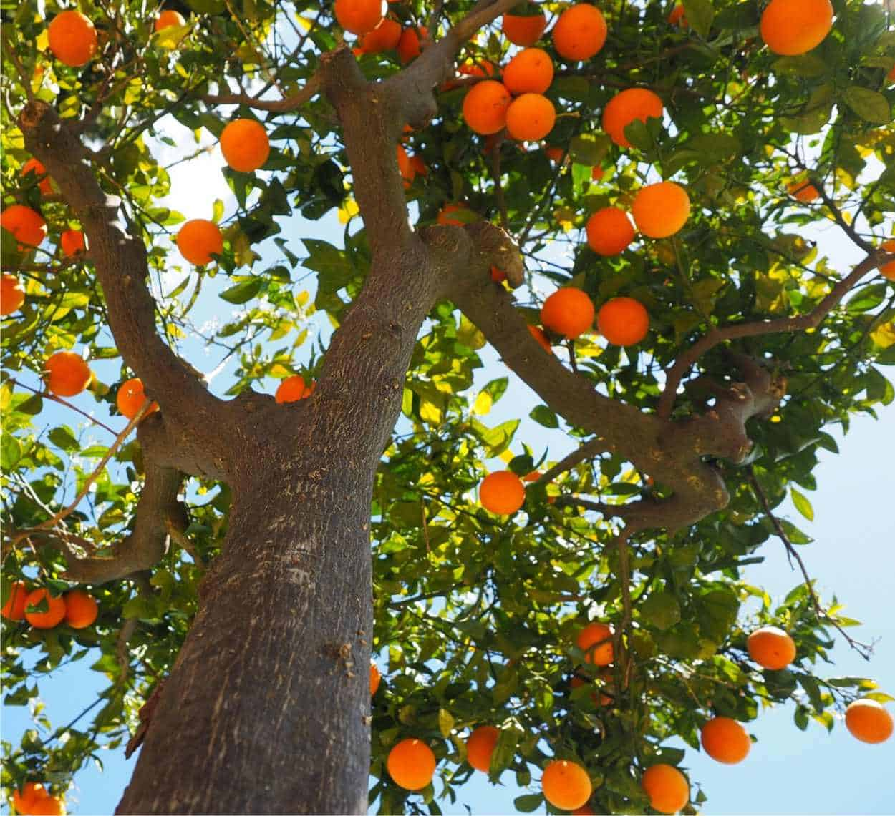

```{r setup, include=FALSE}
knitr::opts_chunk$set(echo = FALSE)
```

## Slide 1


\begin{columns}
\begin{column}{0.50\textwidth}
\onslide<1-2>Le arancette sono molto carine.
\begin{figure}
\centering
\onslide<2-2>
\caption{Arancette su albero}
\label{fig:arancio1}
```{r,out.width="50%", eval = T, echo=FALSE}

```
\end{figure}
\end{column}

\onslide<3->
\begin{column}{0.50\textwidth}
Gli aranci sono molto carini.
\end{column}

\end{columns}

## 

::: columns
:::: column
```{r}
plot(Orange)
```
::::
:::: column
```{r}
head(Orange)
```
::::
:::


##

\onslide<3->

\begin{block}{Quale sarà la circonferenza delle arancette?}

Scopriamolo insieme!

\end{block}

\onslide<2-2>

\begin{exampleblock}{E quale sarà l'età degli alberi?}

Degli aranci per la precisione

\end{exampleblock}

\onslide<1->

\begin{alertblock}{E come si chiameranno gli alberi?}

Alberto, Alfonso, Alfredo, Antonio, Augusto, Ascanio
\begin{figure}
\centering
\caption{Arancette su albero}
\label{fig:arancio}
```{r,out.width="10%", eval = T, echo=FALSE}

```
\end{figure}

\end{alertblock}
